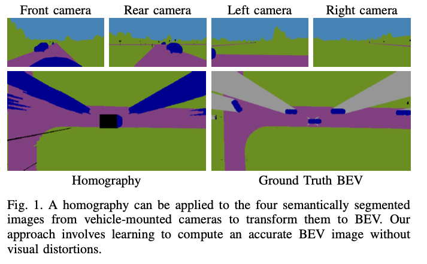
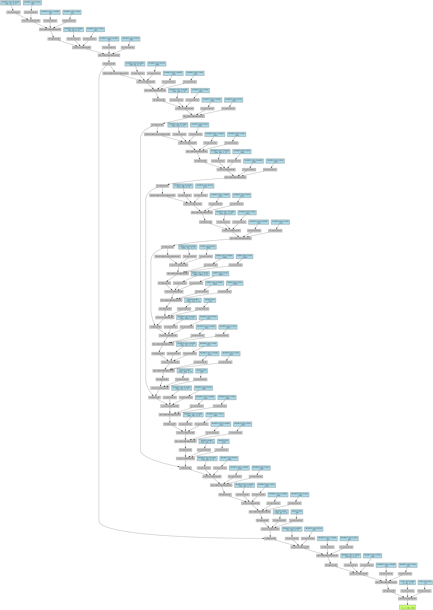
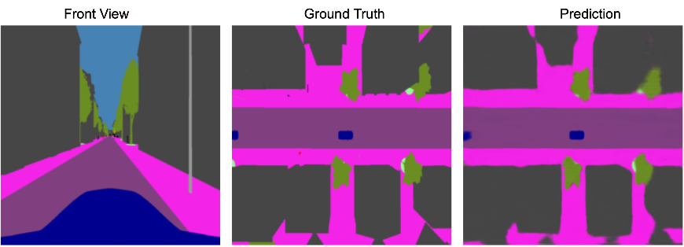

# Cam2BEV: Multi-View Camera to Bird's Eye View Transformation

**An advanced computer vision project that transforms multi-view vehicle-mounted camera images into a semantically segmented bird's eye view (BEV) representation. It employs a custom UNetXST architecture to process inputs from four cameras (front, rear, left, right) and generate an accurate BEV output.**

---

**Technical Topics:** *Computer Vision, UNet, Spatial Transformer Networks, Data Augmentation, Image Segmentation, Multi-View Fusion, Sim2Real Transfer Learning*

**Tools / Technologies:** *Python, PyTorch, OpenCV, PIL, Torchvision*

**Use Case:** *Environment perception for autonomous vehicles, particularly transforming multiple camera views into a unified bird's eye view for improved situational awareness and decision-making in complex traffic scenarios.*

---

### Sample:

A diagram showing the high level idea of Cam2BEV.

<a href="path_to_video_demo">
    
</a>

### Performance:

Model performance metrics based on evaluation:

```
Average MSE: 0.04
Average PSNR: 26.5 dB
Average SSIM: 0.82
Average MIoU: 0.75
Average Pixel Accuracy: 86.2%
Average FWIoU: 0.72
```

---

### Technical Explanation:

#### Data Handling:

The `BEVDataset` class in `dataloader.py` manages data loading and preprocessing:

- **Supports different data splits (train, val, test):** For robust model evaluation.
- **Image resizing to 256x256:** Ensures consistent input dimensions and reduces computational load.
- **Concatenation of four view inputs along the channel dimension:** Enables the model to process all views simultaneously.
- **Returns input tensor of shape (12, 256, 256) and target of shape (3, 256, 256):** Facilitates efficient batch processing.

#### Model Architecture:

The `UNetXST` class implements a custom U-Net architecture with cross-view spatial transformer modules:

1. **Input Layer:** Accepts tensor of shape (B, 12, 256, 256) where B is batch size. The 12 channels correspond to 4 views with 3 color channels each, allowing for simultaneous processing of all views.

2. **Encoder:** 4 convolutional blocks with max pooling, doubling channels each time:
   - ConvBlock1: 12 → 64 channels
   - ConvBlock2: 64 → 128 channels
   - ConvBlock3: 128 → 256 channels
   - ConvBlock4: 256 → 512 channels
   
   **Rationale:** The progressive increase in channel depth allows the network to capture increasingly complex features while reducing spatial dimensions.

3. **Bottleneck:** ConvBlock 512 → 1024 channels
   
   **Rationale:** The bottleneck layer compresses spatial information and forces the network to encode the most salient features.

4. **Decoder:** 4 transposed convolutions with skip connections:
   - UpConv4 + Skip4: 1024 → 512 channels
   - UpConv3 + Skip3: 512 → 256 channels
   - UpConv2 + Skip2: 256 → 128 channels
   - UpConv1 + Skip1: 128 → 64 channels
   
   **Rationale:** Transposed convolutions upsample the feature maps, while skip connections preserve fine-grained spatial information from the encoder, crucial for accurate segmentation.

5. **Output:** Final 1x1 convolution, 64 → 3 channels
   
   **Rationale:** The 1x1 convolution reduces the channel dimension to match the desired output classes, producing the final segmentation map.

Each `ConvBlock` employs a double 3x3 convolution with batch normalization and ReLU activation:

```python
class ConvBlock(nn.Module):
    def __init__(self, in_channels, out_channels):
        # Initialization code...

    def forward(self, x):
        return self.conv(x)
```

Key Design Decisions:

- Double 3x3 convolution: Increases the receptive field without losing spatial resolution.
- Batch normalization: Stabilizes training and mitigates internal covariate shift.
- ReLU activation: Introduces non-linearity without the vanishing gradient problem.

<a>
    
</a>

### Evaluation Metrics:
The Cam2BEV system uses the following metrics for evaluation:

Below is an image showing a model output as compared to ground truth:

<a href="path_to_video_demo">
    
</a>


**Mean Intersection over Union (MIoU):**
```python
def calculate_miou(pred, target, num_classes):
    ious = []
    for cls in range(num_classes):
        pred_mask = (pred == cls)
        target_mask = (target == cls)
        intersection = (pred_mask & target_mask).sum()
        union = (pred_mask | target_mask).sum()
        iou = intersection / (union + 1e-6)
        ious.append(iou)
    return np.mean(ious)
```

MIoU provides a comprehensive measure of segmentation accuracy across all classes, balancing precision and recall.

Per-class IoU: Calculated similarly to MIoU but reported for each class separately, allowing for detailed analysis of model performance on different semantic categories.

**Pixel Accuracy:**

```python
def pixel_accuracy(pred, target):
    correct = (pred == target).sum()
    total = pred.numel()
    return correct / total
```

Provides a simple measure of overall segmentation correctness but can be biased by class imbalance.

**Frequency Weighted IoU (FWIoU):**

```python
def fw_iou(pred, target, num_classes):
    ious = []
    frequencies = []
    for cls in range(num_classes):
        pred_mask = (pred == cls)
        target_mask = (target == cls)
        intersection = (pred_mask & target_mask).sum()
        union = (pred_mask | target_mask).sum()
        iou = intersection / (union + 1e-6)
        freq = target_mask.sum() / target_mask.numel()
        ious.append(iou)
        frequencies.append(freq)
    return np.sum(np.array(ious) * np.array(frequencies))
```

FWIoU weights the IoU of each class by its pixel frequency, providing a balanced measure for datasets with class imbalance.

### Next Steps:
Future work to enhance the Cam2BEV project could include:

1. Implementation of attention mechanisms to improve feature fusion across different views.
2. Exploration of more advanced architectures like Transformer-based models for improved spatial reasoning.
3. Integration of temporal information for video sequence processing.
4. Development of a more sophisticated data augmentation pipeline to improve model generalization.
5. Investigation of domain adaptation techniques for better real-world performance.
6. Optimization of the model for real-time inference on embedded systems.

### Citations:
```
Original Paper and Sample Image Credits:

Reiher, L., Lampe, B., & Eckstein, L. (2020). A Sim2Real Deep Learning Approach for the Transformation of Images from Multiple Vehicle-Mounted Cameras to a Semantically Segmented Image in Bird's Eye View. arXiv:2005.04078v1 [cs.CV].
```

